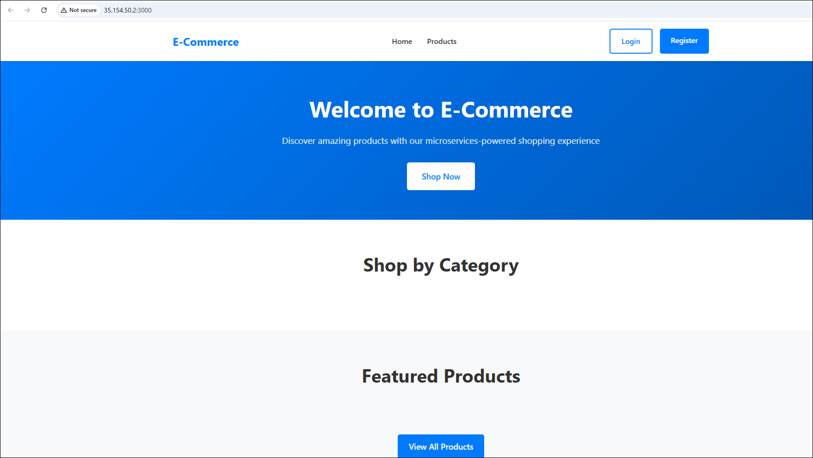

# E-Commerce Microservices Application

A full-stack MERN e-commerce application built with microservices architecture, featuring 4 separate Node.js backend services and a React frontend.

## 🏗️ Architecture Overview

This application demonstrates modern microservices architecture with the following components:

```
Frontend (React) → API Gateway → Microservices
                                    ├── User Service (3001)
                                    ├── Product Service (3002)
                                    ├── Cart Service (3003)
                                    └── Order Service (3004)
```

## 🔧 Technology Stack

### Backend
- **Runtime**: Node.js with Express.js
- **Database**: MongoDB with Mongoose ODM
- **Authentication**: JWT tokens
- **Architecture**: RESTful APIs with microservices

### Frontend
- **Framework**: React 18
- **Routing**: React Router
- **State Management**: React Query + Context API
- **HTTP Client**: Axios
- **Styling**: CSS3 with responsive design

## 📦 Microservices

### 1. User Service (Port 3001)
- User registration and authentication
- Profile management
- JWT token generation and validation
- User data persistence

**Endpoints:**
- `POST /api/auth/register` - User registration
- `POST /api/auth/login` - User authentication
- `GET /api/auth/me` - Get current user
- `GET /api/users/profile` - Get user profile
- `PUT /api/users/profile` - Update user profile

### 2. Product Service (Port 3002)
- Product catalog management
- Category management
- Product search and filtering
- Inventory tracking

**Endpoints:**
- `GET /api/products` - Get products with filtering/pagination
- `GET /api/products/:id` - Get single product
- `POST /api/products` - Create product (admin)
- `PUT /api/products/:id` - Update product (admin)
- `DELETE /api/products/:id` - Soft delete product (admin)
- `GET /api/categories` - Get all categories
- `POST /api/categories` - Create category (admin)

### 3. Cart Service (Port 3003)
- Shopping cart management
- Add/remove/update cart items
- Cart validation
- Integration with Product Service

**Endpoints:**
- `GET /api/cart/:userId` - Get user's cart
- `POST /api/cart/:userId/items` - Add item to cart
- `PUT /api/cart/:userId/items/:productId` - Update cart item
- `DELETE /api/cart/:userId/items/:productId` - Remove cart item
- `DELETE /api/cart/:userId` - Clear entire cart
- `POST /api/cart/:userId/validate` - Validate cart items

### 4. Order Service (Port 3004)
- Order creation and management
- Payment processing simulation
- Order status tracking
- Integration with Cart and Product Services

**Endpoints:**
- `GET /api/orders/user/:userId` - Get user's orders
- `GET /api/orders/:id` - Get single order
- `POST /api/orders` - Create new order
- `PUT /api/orders/:id/status` - Update order status
- `DELETE /api/orders/:id` - Cancel order
- `POST /api/payments/process` - Process payment
- `POST /api/payments/refund` - Process refund

## 🚀 Getting Started

### Prerequisites
- Node.js 16+ and npm
- MongoDB (local or cloud instance)

### Installation

1. **Clone the repository**
```bash
git clone <repository-url>
cd ecommerce-microservices
```

2. **Install dependencies for each service**
```bash

# Install User Service dependencies
cd backend/user-service && npm install

# Install Product Service dependencies
cd ../product-service && npm install

# Install Cart Service dependencies
cd ../cart-service && npm install

# Install Order Service dependencies
cd ../order-service && npm install

# Install Frontend dependencies
cd ../../frontend && npm install
```

3. **Set up environment variables**

Create `.env` files in each service directory:

**backend/user-service/.env:**
```env
PORT=3001
MONGODB_URI=mongodb://localhost:27017/ecommerce_users
JWT_SECRET=your-jwt-secret-key
```

**backend/product-service/.env:**
```env
PORT=3002
MONGODB_URI=mongodb://localhost:27017/ecommerce_products
```

**backend/cart-service/.env:**
```env
PORT=3003
MONGODB_URI=mongodb://localhost:27017/ecommerce_carts
PRODUCT_SERVICE_URL=http://localhost:3002
```

**backend/order-service/.env:**
```env
PORT=3004
MONGODB_URI=mongodb://localhost:27017/ecommerce_orders
CART_SERVICE_URL=http://localhost:3003
PRODUCT_SERVICE_URL=http://localhost:3002
USER_SERVICE_URL=http://localhost:3001
```

**frontend/.env:**
```env
REACT_APP_USER_SERVICE_URL=http://localhost:3001
REACT_APP_PRODUCT_SERVICE_URL=http://localhost:3002
REACT_APP_CART_SERVICE_URL=http://localhost:3003
REACT_APP_ORDER_SERVICE_URL=http://localhost:3004
```

### Running the Application


** Run services individually**

Terminal 1 - User Service:
```bash
cd backend/user-service && npm start
```

Terminal 2 - Product Service:
```bash
cd backend/product-service && npm start
```

Terminal 3 - Cart Service:
```bash
cd backend/cart-service && npm start
```

Terminal 4 - Order Service:
```bash
cd backend/order-service && npm start
```

Terminal 5 - Frontend:
```bash
cd frontend && npm start
```

The application will be available at:
- Frontend: http://localhost:3000
- User Service: http://localhost:3001
- Product Service: http://localhost:3002
- Cart Service: http://localhost:3003
- Order Service: http://localhost:3004

## 🎯 Features

### User Features
- **Authentication**: Register and login with JWT tokens
- **Product Browsing**: View products with search, filtering, and pagination
- **Shopping Cart**: Add, update, and remove items
- **Checkout Process**: Complete order placement with shipping and payment
- **Order Management**: View order history and track status
- **Profile Management**: Update personal information and addresses

### Admin Features (Future Enhancement)
- Product and category management
- Order status updates
- Inventory management
- User management

### Technical Features
- **Microservices Architecture**: Loosely coupled services
- **RESTful APIs**: Standard HTTP methods and status codes
- **Data Validation**: Input validation and error handling
- **Cross-Service Communication**: HTTP-based service interactions
- **Responsive Design**: Mobile-friendly user interface
- **Error Handling**: Comprehensive error management
- **Loading States**: User-friendly loading indicators

## 📁 Project Structure

```
ecommerce-microservices/
├── backend/
│   ├── user-service/
│   │   ├── models/
│   │   ├── routes/
│   │   ├── middleware/
│   │   ├── server.js
│   │   └── package.json
│   ├── product-service/
│   │   ├── models/
│   │   ├── routes/
│   │   ├── server.js
│   │   └── package.json
│   ├── cart-service/
│   │   ├── models/
│   │   ├── routes/
│   │   ├── server.js
│   │   └── package.json
│   └── order-service/
│       ├── models/
│       ├── routes/
│       ├── server.js
│       └── package.json
├── frontend/
│   ├── public/
│   ├── src/
│   │   ├── components/
│   │   ├── contexts/
│   │   ├── pages/
│   │   ├── services/
│   │   ├── App.js
│   │   └── index.js
│   └── package.json
├── package.json
└── README.md
```

## 🔧 API Testing

You can test the APIs using tools like Postman or curl:

```bash
# Health check for all services
curl http://localhost:3001/health
curl http://localhost:3002/health
curl http://localhost:3003/health
curl http://localhost:3004/health

# Register a new user
curl -X POST http://localhost:3001/api/auth/register \
  -H "Content-Type: application/json" \
  -d '{"firstName":"John","lastName":"Doe","email":"john@example.com","password":"password123"}'

# Get products
curl http://localhost:3002/api/products

# Get categories
curl http://localhost:3002/api/categories
```

## 🚀 Deployment

### Local Development
Follow the [Getting Started](#-getting-started) section above for local development setup.

### Production Deployment Options

#### 1. Docker Deployment
See the [Docker Deployment](#-docker-deployment) section for containerized deployment.

#### 2. Cloud Infrastructure with Terraform
See the [Terraform Infrastructure Deployment](#️-terraform-infrastructure-deployment) section for AWS cloud deployment.

### Production Considerations

1. **Environment Variables**: Use proper environment variable management
2. **Database**: Use MongoDB Atlas or other managed database services
3. **Process Management**: Use PM2 or similar for process management
4. **Load Balancing**: Implement load balancing for high availability
5. **Monitoring**: Add logging and monitoring solutions
6. **Security**: Implement rate limiting, CORS, and other security measures
7. **SSL/TLS**: Configure HTTPS for secure communication
8. **Backup**: Implement database backup and recovery strategies

## 🤝 Contributing

1. Fork the repository
2. Create a feature branch
3. Commit your changes
4. Push to the branch
5. Create a Pull Request

## 📝 License

This project is licensed under the MIT License.

## 🆘 Support

For support and questions:
- Check the documentation
- Review API endpoints and expected payloads
- Ensure all services are running
- Verify database connections
- Check environment variables

## � Docker Deployment

### Available Docker Images

The application is containerized and available on Docker Hub. Replace `your-dockerhub-username` with your actual Docker Hub username:

```bash
# Frontend
docker pull your-dockerhub-username/frontend:latest

# Backend Services
docker pull your-dockerhub-username/user-service:latest
docker pull your-dockerhub-username/product-service:latest
docker pull your-dockerhub-username/cart-service:latest
docker pull your-dockerhub-username/e-commercestore-order-service:latest
```

### Building and Pushing Docker Images

1. **Update Docker Hub Username**: Replace `your-dockerhub-username` with your actual username in all commands below.

2. **Login to Docker Hub**:
```bash
docker login
```

3. **Build and Push Images**:

```bash
# Build and push frontend
docker build -t your-dockerhub-username/frontend:latest ./frontend
docker push your-dockerhub-username/frontend:latest

# Build and push user service
docker build -t your-dockerhub-username/user-service:latest ./backend/user-service
docker push your-dockerhub-username/user-service:latest

# Build and push product service
docker build -t your-dockerhub-username/product-service:latest ./backend/product-service
docker push your-dockerhub-username/product-service:latest

# Build and push cart service
docker build -t your-dockerhub-username/cart-service:latest ./backend/cart-service
docker push your-dockerhub-username/cart-service:latest

# Build and push order service
docker build -t your-dockerhub-username/e-commercestore-order-service:latest ./backend/order-service
docker push your-dockerhub-username/e-commercestore-order-service:latest
```

### Running with Docker Compose

1. **Create docker-compose.yml**:
```yaml
version: '3.8'
services:
  frontend:
    image: your-dockerhub-username/frontend:latest
    ports:
      - "3000:3000"
    environment:
      - REACT_APP_USER_SERVICE_URL=http://localhost:3001
      - REACT_APP_PRODUCT_SERVICE_URL=http://localhost:3002
      - REACT_APP_CART_SERVICE_URL=http://localhost:3003
      - REACT_APP_ORDER_SERVICE_URL=http://localhost:3004
    depends_on:
      - user-service
      - product-service
      - cart-service
      - order-service

  user-service:
    image: your-dockerhub-username/user-service:latest
    ports:
      - "3001:3001"
    environment:
      - PORT=3001
      - MONGODB_URI=mongodb://mongo:27017/ecommerce_users
      - JWT_SECRET=your-jwt-secret-key
    depends_on:
      - mongo

  product-service:
    image: your-dockerhub-username/product-service:latest
    ports:
      - "3002:3002"
    environment:
      - PORT=3002
      - MONGODB_URI=mongodb://mongo:27017/ecommerce_products
    depends_on:
      - mongo

  cart-service:
    image: your-dockerhub-username/cart-service:latest
    ports:
      - "3003:3003"
    environment:
      - PORT=3003
      - MONGODB_URI=mongodb://mongo:27017/ecommerce_carts
      - PRODUCT_SERVICE_URL=http://product-service:3002
    depends_on:
      - mongo
      - product-service

  order-service:
    image: your-dockerhub-username/e-commercestore-order-service:latest
    ports:
      - "3004:3004"
    environment:
      - PORT=3004
      - MONGODB_URI=mongodb://mongo:27017/ecommerce_orders
      - CART_SERVICE_URL=http://cart-service:3003
      - PRODUCT_SERVICE_URL=http://product-service:3002
      - USER_SERVICE_URL=http://user-service:3001
    depends_on:
      - mongo
      - cart-service
      - product-service
      - user-service

  mongo:
    image: mongo:6.0
    ports:
      - "27017:27017"
    volumes:
      - mongo_data:/data/db
    environment:
      - MONGO_INITDB_ROOT_USERNAME=admin
      - MONGO_INITDB_ROOT_PASSWORD=password

volumes:
  mongo_data:
```

2. **Run the application**:
```bash
# Start all services
docker-compose up -d

# View logs
docker-compose logs -f

# Stop all services
docker-compose down

# Stop and remove volumes
docker-compose down -v
```

## 🏗️ Terraform Infrastructure Deployment

Deploy the application infrastructure to AWS using Terraform.

### Prerequisites
- AWS CLI configured with appropriate credentials
- Terraform installed (v1.0+)
- Docker images pushed to Docker Hub

### Terraform Commands

1. **Navigate to Terraform directory**:
```bash
cd terraform
```

2. **Initialize Terraform**:
```bash
terraform init
```

3. **Plan the deployment**:
```bash
terraform plan -var="dockerhub_username=your-dockerhub-username"
```

4. **Apply the infrastructure**:
```bash
terraform apply -var="dockerhub_username=your-dockerhub-username"
```

5. **View outputs**:
```bash
terraform output
```

6. **Destroy infrastructure** (when no longer needed):
```bash
terraform destroy -var="dockerhub_username=your-dockerhub-username"
```

### Terraform Variables

Create a `terraform.tfvars` file in the terraform directory:

```hcl
# terraform.tfvars
dockerhub_username = "your-dockerhub-username"
aws_region = "your-preferred-region"
environment = "production"
instance_type = "t3.medium"
key_name = "your-aws-key-pair"

# Database configuration
db_instance_class = "db.t3.micro"
db_allocated_storage = 20
db_username = "admin"
db_password = "your-secure-database-password"
```

### Infrastructure Components

The Terraform configuration deploys:

- **EC2 Instances**: For running Docker containers
- **RDS MongoDB**: Managed database service
- **VPC & Subnets**: Network infrastructure
- **Security Groups**: Firewall rules
- **Load Balancer**: Application load balancer
- **Auto Scaling**: Auto scaling groups for high availability

### Accessing the Deployed Application

After successful deployment, Terraform will output:
- **Load Balancer URL**: Access point for the application
- **Database Endpoint**: MongoDB connection string
- **EC2 Instance IPs**: For direct access if needed

```bash
# Example outputs
terraform output lb_dns_name
terraform output database_endpoint
```

## 🔮 Future Enhancements

- **API Gateway**: Centralized request routing and authentication
- **Message Queues**: Async communication between services
- **Caching**: Redis caching for improved performance
- **Search Engine**: Elasticsearch for advanced product search
- **File Upload**: Image upload and management
- **Email Service**: Order confirmations and notifications
- **Admin Dashboard**: Administrative interface
- **Analytics**: Order and user analytics
- **Payment Integration**: Real payment gateway integration
- **Kubernetes Deployment**: Container orchestration with K8s
- **CI/CD Pipeline**: Automated deployment pipeline
- **Monitoring & Logging**: Application monitoring and centralized logging

## 📚 Additional Resources

### Useful Commands

**Note:** Replace `your-dockerhub-username` with your actual Docker Hub username in all commands below.

docker login

```bash
# Build and push all Docker images to Docker Hub
docker build -t your-dockerhub-username/user-service:latest ./backend/user-service
docker push your-dockerhub-username/user-service:latest

docker build -t your-dockerhub-username/product-service:latest ./backend/product-service
docker push your-dockerhub-username/product-service:latest

docker build -t your-dockerhub-username/cart-service:latest ./backend/cart-service
docker push your-dockerhub-username/cart-service:latest

docker build -t your-dockerhub-username/e-commercestore-order-service:latest ./backend/order-service
docker push your-dockerhub-username/e-commercestore-order-service:latest

docker build -t your-dockerhub-username/frontend:latest ./frontend
docker push your-dockerhub-username/frontend:latest

# Verify Docker images
docker images | findstr your-dockerhub-username

# Verify repositories on Docker Hub
docker pull your-dockerhub-username/user-service:latest
docker pull your-dockerhub-username/product-service:latest
docker pull your-dockerhub-username/cart-service:latest
docker pull your-dockerhub-username/e-commercestore-order-service:latest
docker pull your-dockerhub-username/frontend:latest
```

### Repository Setup Instructions

1. **Create Docker Hub Account**: Sign up at [hub.docker.com](https://hub.docker.com) if you don't have an account
2. **Replace Username**: Update `your-dockerhub-username` with your actual Docker Hub username in all commands
3. **Login to Docker Hub**: Run `docker login` before pushing images

### Example with Sample Username
If your Docker Hub username is `johndoe`, the commands would look like:
```bash
docker build -t johndoe/user-service:latest ./backend/user-service
docker push johndoe/user-service:latest
# ... and so on for other services
```

### Quick Deployment Commands

**Note:** Replace `your-dockerhub-username` with your actual Docker Hub username.

```bash
# For local testing with Docker Compose
docker-compose up -d

# For individual service testing
docker run -d -p 3001:3001 --name user-service your-dockerhub-username/user-service:latest
docker run -d -p 3002:3002 --name product-service your-dockerhub-username/product-service:latest
docker run -d -p 3003:3003 --name cart-service your-dockerhub-username/cart-service:latest
docker run -d -p 3004:3004 --name order-service your-dockerhub-username/e-commercestore-order-service:latest
docker run -d -p 3000:3000 --name frontend your-dockerhub-username/frontend:latest
```

## 🚀 AWS Infrastructure Deployment with Terraform

### Prerequisites
- AWS CLI configured with valid credentials
- Terraform installed
- Valid AWS account with appropriate permissions

### Terraform Configuration
The project includes Terraform configuration files in the `/terraform` directory:
- `main.tf` - Infrastructure resources
- `variables.tf` - Variable definitions
- `terraform.tfvars` - Variable values
- `outputs.tf` - Output definitions
- `provider.tf` - AWS provider configuration

### ⚠️ Important: Update terraform.tfvars
Before running Terraform, you **must** update the `terraform/terraform.tfvars` file with your actual AWS resource values:

```hcl
# terraform/terraform.tfvars
aws_region = "your-preferred-region"          # e.g., "us-east-1", "eu-west-1", "ap-south-1"
ami = "ami-xxxxxxxxxxxxxxxxx"                 # Find AMI ID for your region
key_name = "your-key-pair-name"               # Your AWS EC2 Key Pair name
instance_type = "t2.micro"                    # Keep as is for free tier
subnet_id = "subnet-xxxxxxxxxxxxxxxxx"       # Your VPC subnet ID
vpc_security_group_ids = ["sg-xxxxxxxxxxxxxxxxx"]  # Your security group ID
volume_size = 20                              # Keep as is
volume_type = "gp2"                           # Keep as is
environment = "dev"                           # Keep as is or change to "prod"
```

#### How to find your AWS resource values:
```bash
# Find your default VPC and subnets
aws ec2 describe-vpcs --filters "Name=is-default,Values=true"
aws ec2 describe-subnets --filters "Name=vpc-id,Values=YOUR_VPC_ID"

# Find security groups
aws ec2 describe-security-groups --filters "Name=group-name,Values=default"

# Find AMI ID for your region (Ubuntu 20.04 LTS)
aws ec2 describe-images --owners 099720109477 --filters "Name=name,Values=ubuntu/images/hvm-ssd/ubuntu-focal-20.04-amd64-server-*" --query 'Images[*].[ImageId,Name]' --output table
```

### Deployment Commands

#### 1. AWS CLI Configuration
```bash
# Configure AWS credentials
aws configure set aws_access_key_id YOUR_ACCESS_KEY_ID
aws configure set aws_secret_access_key YOUR_SECRET_ACCESS_KEY
aws configure set default.region YOUR_PREFERRED_REGION

# Verify authentication
aws sts get-caller-identity
```

#### 2. Terraform Deployment
```bash
# Navigate to terraform directory
cd terraform

# IMPORTANT: Update terraform.tfvars with your AWS resource values first!
# Edit terraform.tfvars and replace placeholder values with actual ones

# Initialize Terraform
terraform init

# Plan the deployment (review changes before applying)
terraform plan

# Apply the configuration
terraform apply -auto-approve
```

### 🎉 Deployment Success!

The Terraform deployment successfully created:

#### ✅ Infrastructure Resources:
1. **Security Group** (`frontend-sg`): `sg-xxxxxxxxxxxxxxxxx`
   - Allows HTTP access on port 3000
   - Allows all outbound traffic

2. **EC2 Instance** (`example_ec2`): `i-xxxxxxxxxxxxxxxxx`
   - Instance type: t2.micro
   - 20GB gp2 EBS volume

3. **Ubuntu Docker Instance** (`ubuntu-docker-instance`): `i-xxxxxxxxxxxxxxxxx`
   - Instance type: t2.micro
   - Auto-configured with Docker and E-commerce microservices

#### 🌐 Application Access:
- **Frontend URL**: http://XX.XXX.XX.X:3000
- **User Service**: http://XX.XXX.XX.X:3001
- **Product Service**: http://XX.XXX.XX.X:3002
- **Cart Service**: http://XX.XXX.XX.X:3003
- **Order Service**: http://XX.XXX.XX.X:3004

### Verification Commands

```bash
# Check instance status
aws ec2 describe-instances --instance-ids i-xxxxxxxxxxxxxxxxx --query 'Reservations[*].Instances[*].[InstanceId,State.Name,PublicIpAddress]' --output table

# Test application connectivity
curl -I http://XX.XXX.XX.X:3000

# PowerShell alternative
Test-NetConnection -ComputerName XX.XXX.XX.X -Port 3000
```

### User Data Script Verification

The user data script automatically:
- ✅ Updates the system packages
- ✅ Installs Docker
- ✅ Starts and enables Docker service
- ✅ Pulls all microservice Docker images
- ✅ Runs all containers on their respective ports

To verify user data execution (if you have SSH access):
```bash
# Check user data logs
sudo cat /var/log/cloud-init-output.log

# Check running containers
sudo docker ps

# Check port status
sudo netstat -tlnp | grep -E ":(3000|3001|3002|3003|3004)"
```



### Cleanup

To destroy the infrastructure:
```bash
terraform destroy -auto-approve
```
